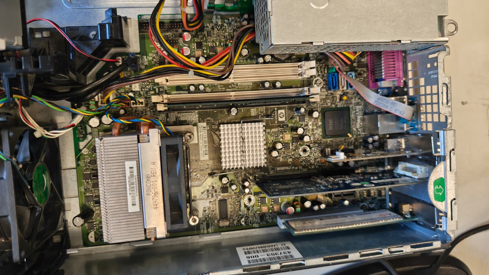
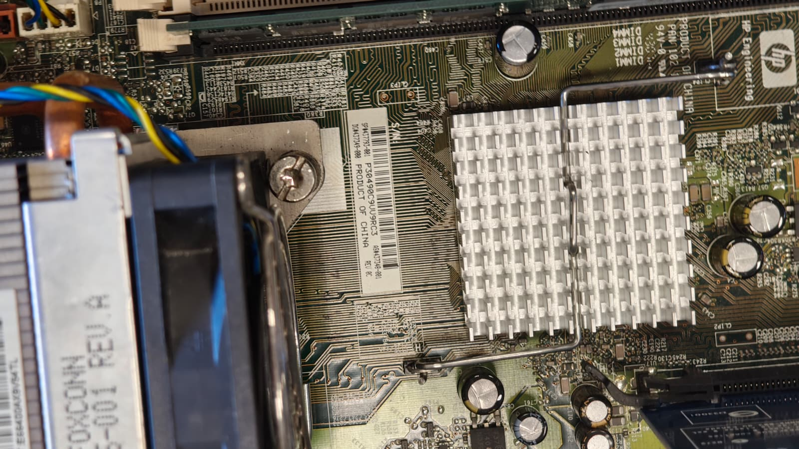
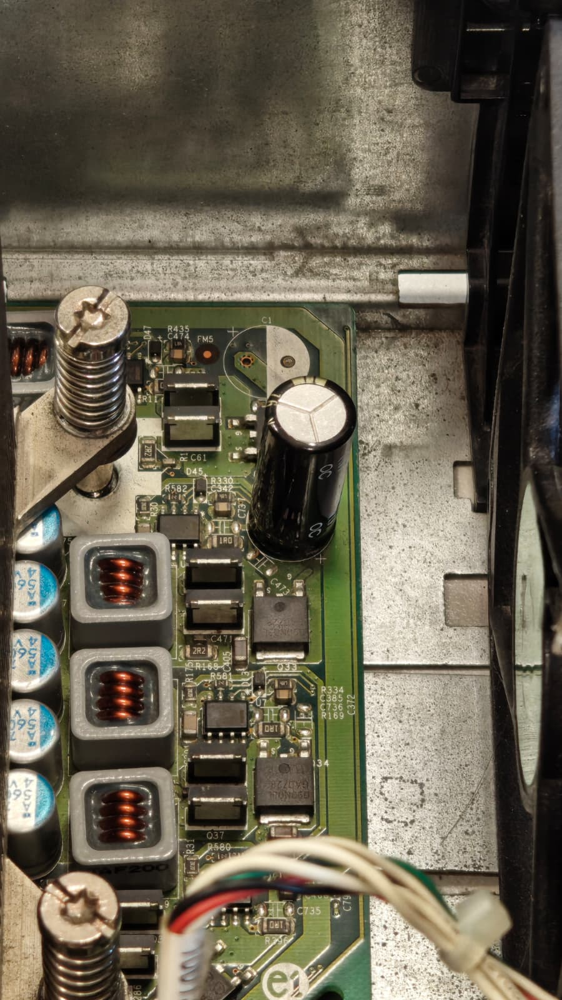

# 10 — Toma de datos (taller)

> Inserta fotos en `assets/img/10-toma_de_datos/` y enlázalas aquí con rutas relativas.

| Componente | Marca/Fabricante | Modelo/Serie | Características técnicas visibles | Foto |
|---|---|---|---|---|
| **Placa base** | HP | DC 7800p SFP | Intel Q35 Express / LGA 775 / 4 slots |    |
| **Microprocesador** | Intel | I2 | E6750 / 667 MHz |  |
| **Memoria RAM** |  |  | Tipo (DDR3/4/5), Capacidad, Frecuencia |  |
| **Disco HDD/SSD** |  |  | Interfaz (SATA/M.2), Capacidad |  |
| **Fuente de alimentación** |  |  | Potencia (W), Certificación (80+) |  |
| **Otros (GPU/Tarjetas)** |  |  |  |  |
