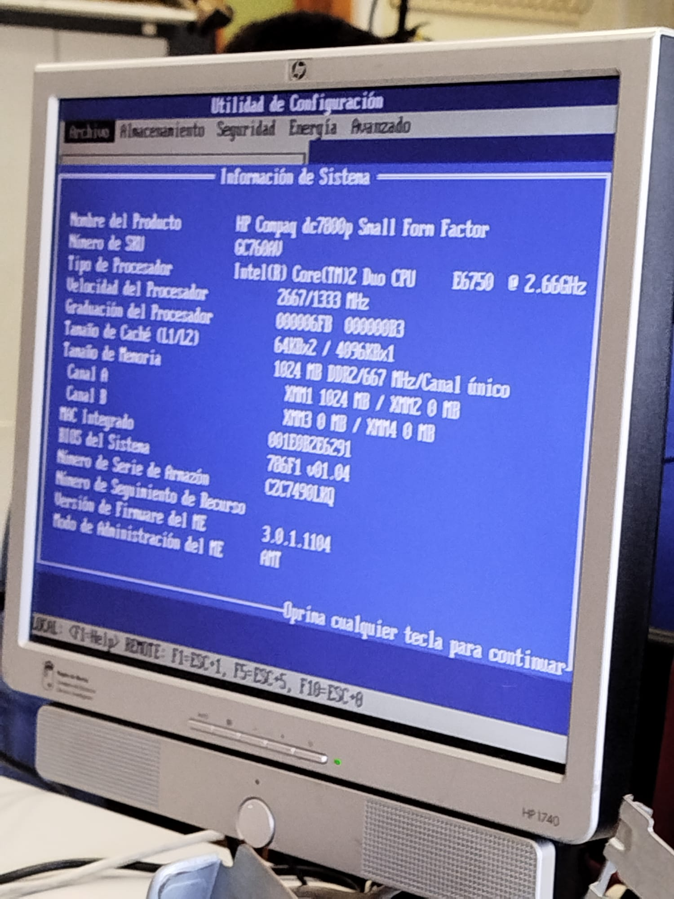
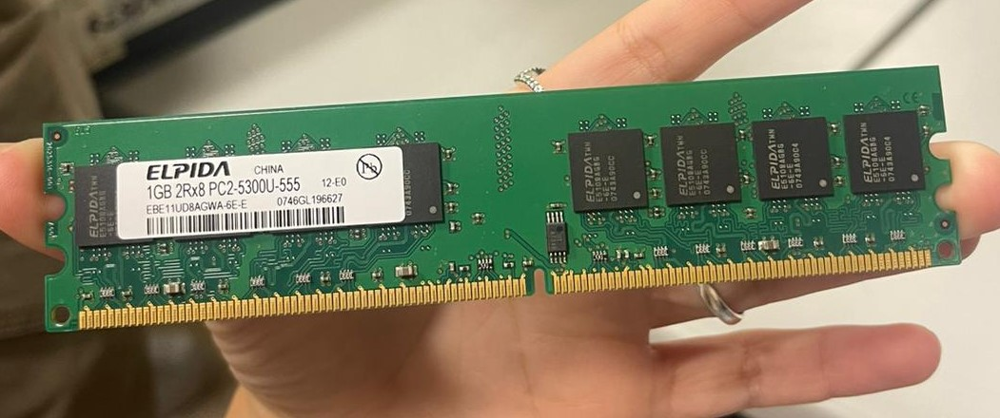
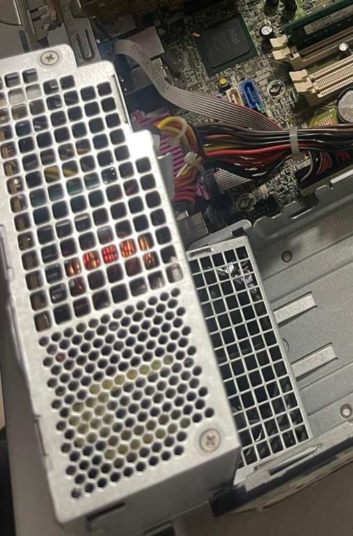
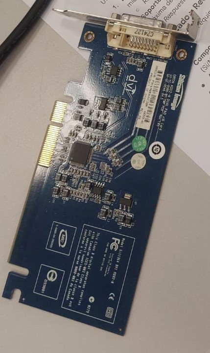
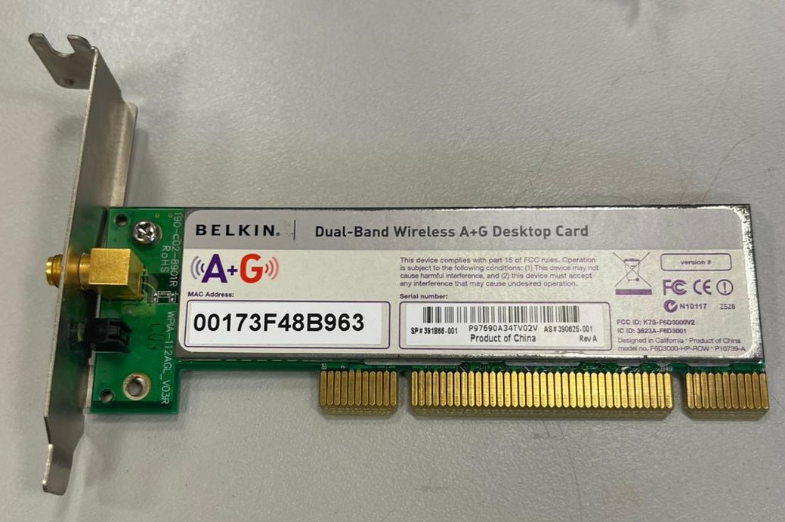
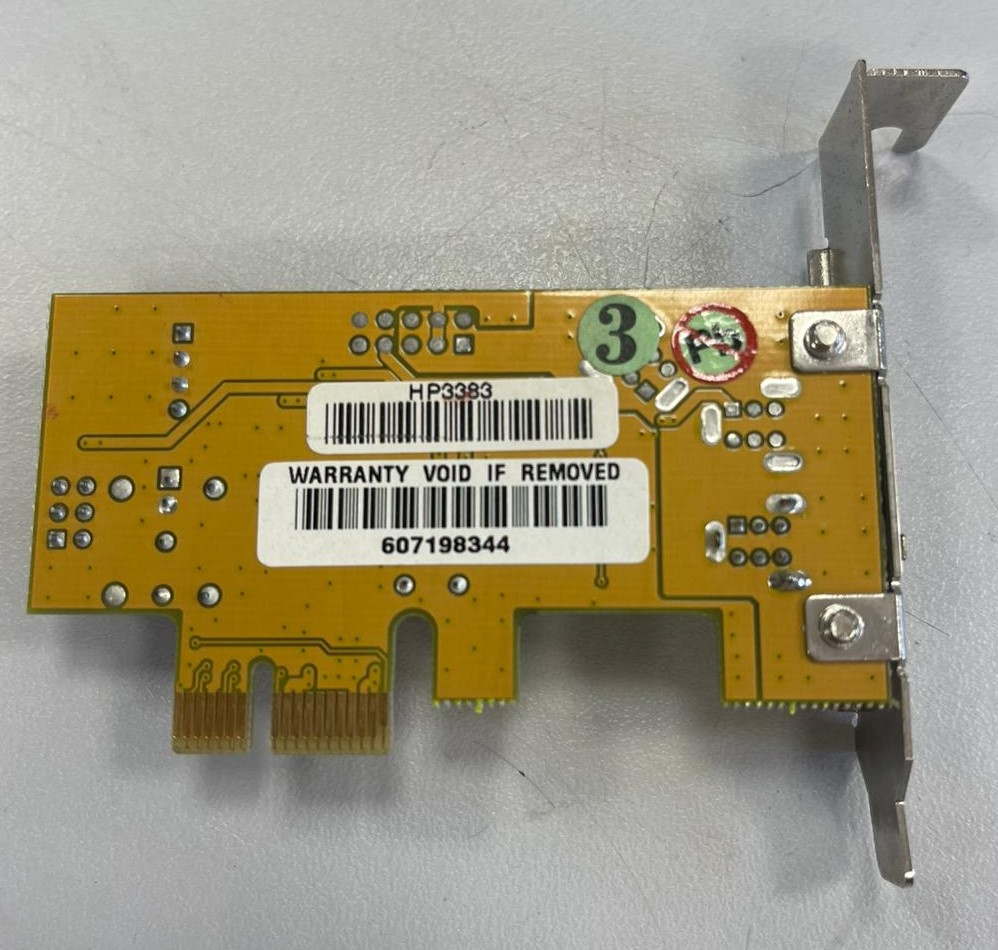
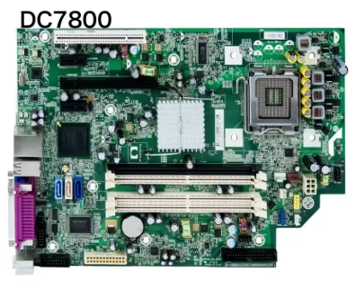
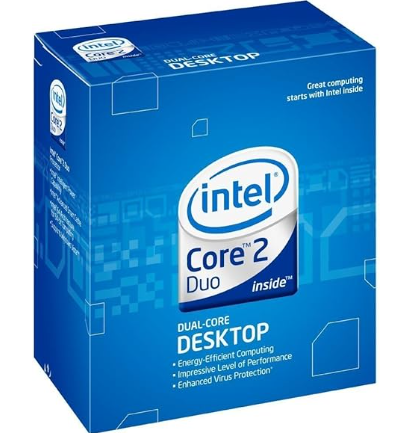
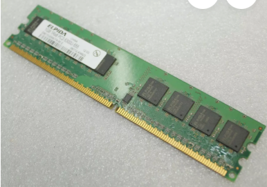

# 90 — ENTREGA ÚNICA (consolidado)

Copia aquí lo esencial de **toma de datos**, **investigación técnica**, **recambios** y **observaciones**, con las **imágenes clave** (rutas relativas).

## Portada
# 00 — Portada
- Alumno/a: Valentin Andriyash Andriiash
- Puesto/Equipo asignado: 2º Grupo
- Fecha: 29/01/2026
- Módulo: **Fundamentos de Hardware (1º ASIR)**
- Unidad: **UT3 — Ensamblado de equipos**
- Reto: **Reto 01 — Práctica de Taller**

## IndiceO
# 01 — Índice
1. [Portada](00-portada.md)
2. [Instrucciones](02-instrucciones.md)
3. [Toma de datos en taller](10-toma_de_datos/plantilla_tabla_taller.md)
4. [Investigación técnica](20-investigacion_tecnica/plantilla_investigacion.md)
5. [Mercado y recambios](30-mercado_y_recambios/plantilla_recambios.md)
6. [Observaciones personales](40-observaciones/plantilla_observaciones.md)
7. [ENTREGA ÚNICA](90-ENTREGA_UNICA.md)
8. [Checklist](99-entrega_y_checklist.md)

---
## Toma de datos — resumen
# 10 — Toma de datos (taller)

> Inserta fotos en `assets/img/10-toma_de_datos/` y enlázalas aquí con rutas relativas.

| Componente | Marca/Fabricante | Modelo/Serie | Características técnicas visibles | Foto |
|---|---|---|---|---|
| **Placa base** | HP | DC 7800p SFP | Intel Q35 Express / LGA 775 / 4 slots |    |
| **Microprocesador** | Intel | I2 | E6750 / 2.666 GHz |  |
| **Memoria RAM** | ELPIDA | PC2-5300U | DDR2, 1GB, 667 MHz |  |
| **Disco HDD/SSD** | No tiene | - | - |  |
| **Fuente de alimentación** | HP | dps 240mb | 240W, NO |  |
| **GPU** | SILICON IMAGE | Sil 1364 DVI ADD2-N | |  |
| **Tarjeta de red** | Belkin | Dual Band Wireless A+G Desktop Band | |  |
| **Adaptador** | Firewire | Jmb 381 | HP 3383 |  |
                            

## Investigación técnica — resumen
# 20 — Investigación técnica (posterior)

## 1) Detalles del procesador
- Modelo exacto: Intel Core 2 Duo CPU E6750 2.66 GHz
- **Núcleos/Hilos:** 2 Nucleos
- **TDP:** 65 TDP  
**Respuesta:** 2 Nucleos  65 TDP

## 2) Soporte de memoria (según placa base)
- Modelo exacto de placa: HP Compaq dc7800p Small Forn Factor
- **Capacidad máxima RAM:**  MAX 8GB
- **Velocidad máxima soportada:** Hasta 1333 MHz con FSB  
**Respuesta:** MAX 8GB y Hasta 1333 MHz con FSB

## Recambios — resumen
# 30 — Mercado y recambios

> Imagina que el equipo falla. Selecciona **tres** componente para recambio.

- **Componente a sustituir:** Procesador, Placa Base y RAM 
- **¿Existe el mismo modelo exacto en tiendas?** : SI
- **Alternativa compatible (socket/ranura):**  
- **Precio aproximado (€):** Procesador 38,97 ; Placa Base 62,39 ; RAM 8,71  
- **URL:**  
Procesador (https://www.amazon.es/dp/B000R9BJ2C?ref=cm_sw_r_cso_wa_apan_dp_8X8REK3JJG76WBF6WBHP&ref_=cm_sw_r_cso_wa_apan_dp_8X8REK3JJG76WBF6WBHP&social_share=cm_sw_r_cso_wa_apan_dp_8X8REK3JJG76WBF6WBHP)  
Placa Base (https://es.aliexpress.com/item/1005008636526118.html?invitationCode=aGpaM0RsTU5LSVlBUDVWSkplMkw5OU56WmNyd3E4TmJBbmx1U0U4L0F0bWVQemFTZUJrNWVWT0s1MU1hdTAyWg&srcSns=sns_WhatsApp&spreadType=socialShare&social_params=61397287410&bizType=ProductDetail&spreadCode=aGpaM0RsTU5LSVlBUDVWSkplMkw5OU56WmNyd3E4TmJBbmx1U0U4L0F0bWVQemFTZUJrNWVWT0s1MU1hdTAyWg&aff_fcid=2ab82ade5b3b41c7957771c8b5e16d01-1769686244286-04162-_EJlNIsG&tt=MG&aff_fsk=_EJlNIsG&aff_platform=default&sk=_EJlNIsG&aff_trace_key=2ab82ade5b3b41c7957771c8b5e16d01-1769686244286-04162-_EJlNIsG&shareId=61397287410&businessType=ProductDetail&platform=AE&terminal_id=1ca7aed10c964f75b3cfd0d661f873ff&afSmartRedirect=y)  
RAM (https://www.ebay.com/itm/305210690499)
- **Captura:**  
Placa:   
Procesador:   
RAM:   

**Justificación breve:** Seria adecuado porque los productos son los mismos y deberian de funcionar de igual manera.

## Observaciones — resumen
# 40 — Observaciones personales

> Anota anomalías o mejoras detectadas: polvo, condensadores hinchados, cables mal gestionados, flujo de aire, etc.

- Observación 1: El ordenador no tenia disco duro, sino un floppy disk 
- Observación 2: La pila de la placa base estaba rota y tuvimos que cambiarla
- Observación 3: El cableado estaba mal organizado dentro del pc

