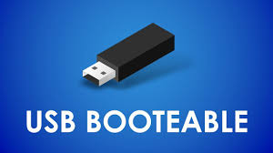
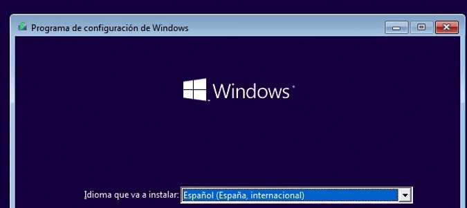

# 30 — Instalación y post‑instalación

- Pasos de instalación (resumen):  
1. Creación de USB Booteable con Linux Mint 21.3 XFCE  
2. Selección de idioma (Español) y disposición de teclado.   
- Paquetes esenciales (navegador, ofimática online, codecs):  
Navegador: Google Chrome  
Ofimática: LibreOffice   
Videollamada: Zoom y WhatsApp Desktop   
- Usuarios/contraseñas y políticas de actualización.  
- Script post‑instalación (si aplica).

**Capturas:** `../assets/img/30-postinstalacion/`

