# 90 — ENTREGA ÚNICA (para exportar a PDF)

Pega aquí **todas** las secciones (02 → 85) con enlaces relativos a imágenes de `../assets/img/`.

# 00 — Portada

- Alumno/a: Valenitn Andriyash Andriiash
- Grupo:  2º
- Reto: **Puesta a Punto Low‑Cost y Competitiva (Centro de mayores)**  
- Fecha: 07/02/2026

# 01 — Índice

1. [Contexto y requisitos](02-contexto_y_requisitos.md)
2. [Diagnóstico inicial del lote](10-diagnostico_inicial_lote.md)
3. [Selección de SO ligero](20-seleccion_SO_ligero.md)
4. [Instalación y post‑instalación](30-instalacion_y_postinstalacion.md)
5. [Accesibilidad para mayores](40-accesibilidad_mayores.md)
6. [Optimización de rendimiento](50-optimizacion_rendimiento.md)
7. [Seguridad básica](60-seguridad_basica.md)
8. [Análisis de mercado y PVP](65-analisis_mercado_y_pvp.md)
9. [Métricas antes/después](70-metricas_antes_despues.md)
10. [Presupuesto HW y ROI](75-plan_presupuesto_hw_y_roi.md)
11. [Replicación en flota](80-replicacion_imagen_flota.md)
12. [Plan de mantenimiento](85-plan_mantenimiento.md)
13. [ENTREGA ÚNICA](90-ENTREGA_UNICA.md)
14. [Glosario](95-glosario.md)
15. [Checklist](99-entrega_y_checklist.md)

# 02 — Contexto y requisitos

**Objetivo:** Dejar la flota **usable** para navegación web básica, correo, videollamadas y ofimática online, en un **centro de mayores**.

**Restricciones:**
- Precio de compra: **20 €** por unidad.
- Gasto HW opcional **máx. 30 €** (si mejora usabilidad y mantiene competitividad).
- **SO ligero** con soporte LTS o estable.
- Accesibilidad y seguridad básicas obligatorias.

**Entregables:** PDF único con evidencias (capturas con URL/fecha). Nombrado: `apellido1_apellido2_nombre_FHW_UT3_Retro_02.pdf`.

# 10 — Diagnóstico inicial del lote

ESCENARIO S2

| ID | CPU | RAM | Almacenamiento | Observaciones |
|---|---|---|---|---|
| PC1 | i3-4130 (1150) | 4GB DDR3 (1x4) | HDD 500GB | Mucho polvo en el ventilador. Pasta térmica seca. |
| PC2 | i3-4130 (1150) | 4GB DDR3 (1x4) | HDD 500GB | Pila CMOS (CR2032) agotada. |
| PC3 | i3-4130 (1150) | 2GB DDR3 (1x2)| HDD 500GB | RAM insuficiente. Disco muy ruidoso. |
| PC4 | i3-4130 (1150) | 4GB DDR3 (1x4)| HDD 500GB | Condensadores de placa en buen estado. |
| PC5 | i3-4130 (1150) | 4GB DDR3 (1x4) | HDD 500GB | Fácil de limpiar. |

- Estado térmico: El cuello de botella es crítico en el HDD.
- Problemas detectados: polvo en ventilador de pc1 con pasta seca, pila agotada en pc2 y en general la ram deberia de mejorarse a 8gb ya que para videollamadas y trabajar es necesario tener 8gb

**Capturas:**
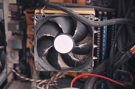
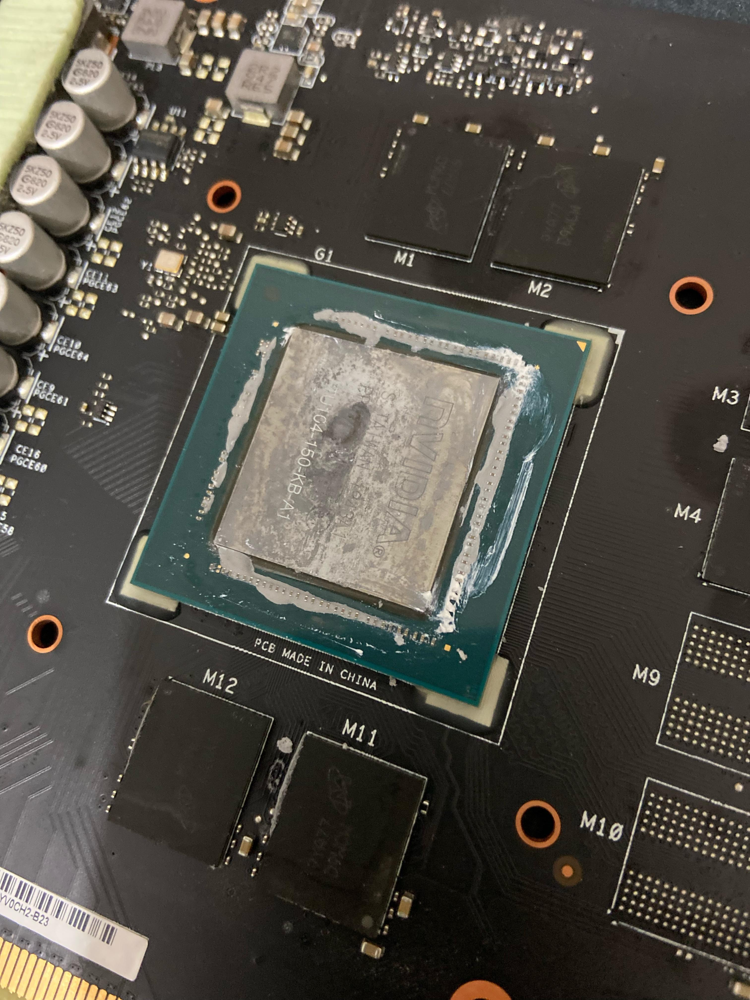
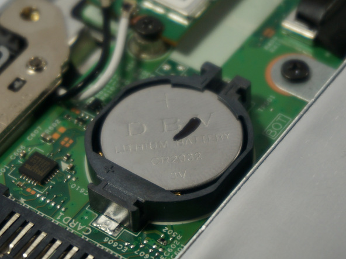

# 20 — Selección de SO ligero

Candidatos (ejemplos): Linux Mint XFCE, Xubuntu, Debian + XFCE, Zorin Lite, Tiny11 (si procede).

| Distro | Requisitos | Soporte | Pros | Contras | Decisión |
|---|---|---|---|---|---|
| Linux Mint XFCE | 2GB RAM / 20GB Disco | LTS (2027) | Muy similar a Windows y estable | Un poco más pesado que Xubuntu | Elegida |
| Xubuntu | 1GB RAM / 8GB Disco | LTS (2027) | Ligero y sólido | Estética anticuada de base | Descartada |
| Zorin Lite | 1GB RAM / 10GB Disco | LTS (2025/27) | Estética moderna. Muy intuitivo. | Menos opciones de personalización | Descartada |
| Debian + XFCE | 1GB RAM / 10GB Disco | LTS | Consumo de recursos mínimo y estabilidad | Configuración inicial más compleja | Descartada |

**Justificación final:** Aunque Debian + XFCE es técnicamente superior en eficiencia, se elige finalmente Linux Mint XFCE por la facilidad de vida que ofrece al administrador y al usuario final
**Capturas:**

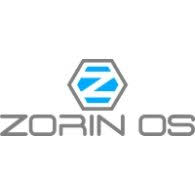
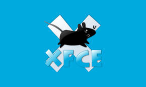

# 30 — Instalación y post‑instalación

- Pasos de instalación (resumen):  
1. Creación de USB Booteable con Linux Mint 21.3 XFCE  
2. Selección de idioma (Español) y disposición de teclado.   
- Paquetes esenciales (navegador, ofimática online, codecs):  
Navegador: Google Chrome  
Ofimática: LibreOffice   
Videollamada: Zoom y WhatsApp Desktop   
- Usuarios/contraseñas y políticas de actualización.  
- Script post‑instalación (si aplica).

**Capturas:**

# 40 — Accesibilidad para mayores

- Tamaño de fuente y escala UI.
- Alto contraste / tema claro.
- Lector de pantalla / dictado (si procede).
- Accesos directos grandes a web frecuentes.
- Configuración de teclado/ratón (doble clic, velocidad, puntero grande).

**Capturas:** 

# 50 — Optimización de rendimiento

- zRAM / swapfile tamaño X:  
zRAM: Activado para comprimir RAM y evitar el uso de swap en disco.  
- Deshabilitar servicios innecesarios:  
Servicios: Deshabilitado Bluetooth (si no hay hardware) e impresión en red (si no se requiere).
- Ajustes navegador (bloqueo de anuncios, memoria caché, flags de bajo consumo).
- Limpieza de temporales.

**Capturas:**

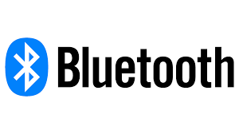

# 60 — Seguridad básica

- Usuario estándar (no admin) + sudo bajo demanda.
- Actualizaciones automáticas de seguridad.
- Navegación segura por listas blancas (si procede).
- Restauración rápida (snapshot o rsync base).

**Capturas:** 
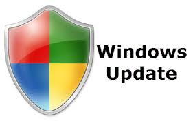

# 65 — Análisis de mercado y PVP objetivo

## 1) Comparables (mínimo 3)
| Plataforma | Enlace | Captura | Precio (€) | Especificación clave | Fecha/Hora |
|---|---|---|---:|---|---|
| Wallapop | https://es.wallapop.com/item/dell-optiplex-3020-mini-pc-i3-ssd-8gb-ram-1226317147 | 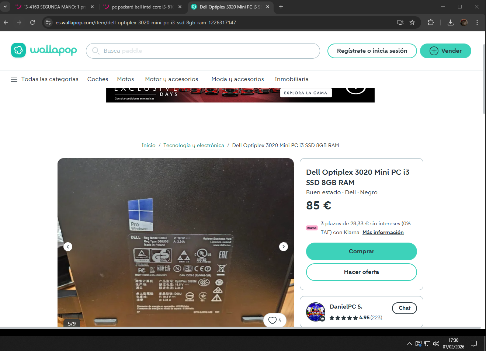 | 85€ |  i3-4160T 3,10 GHz/8gb ddr3 1600 mhz / SSD 250GB | 17:30 07/02/2026 |
| eBay | https://www.ebay.es/itm/177599300809?_skw=8GB+RAM+%2F+256GB+SSD+%2F+i3-4160&itmmeta=01KGWE3W9ANXR3HV5W2APXC9DV&hash=item2959be44c9:g:FiEAAeSwFQ9o263Q&itmprp=enc%3AAQALAAABAGfYFPkwiKCW4ZNSs2u11xDch5KyN233gHpMZZeW7u0aOWF1Z19Z2ZbUNBmEKQBYj13MRfnkeLnMZgTWDRIVTd%2FIrzGlHbOrxLWEuIpaAB1FP7zAhJLyXXRzpu5qr5J8ErwBjmdd8D%2BMOa3nQahyHJoxt%2FlHaSA0kFWJl9rx5GDiuC30E8S2kGuBBLtplY1CpofC7jnYz6c%2FkSInxHAi6XxPyAHG1Li6%2FsTRqi5sdq1HC79ggUl8yRYYtaf0hs%2BWcIUV28lgqBNaxC4%2B8%2BJPYjR8dVtCF9IzSZr9weaxAMOJLrTDBGePFHUqRyvYDha%2FGQNApde2ZJSTqJ0xvkSsgec%3D%7Ctkp%3ABk9SR-rEj46HZw | 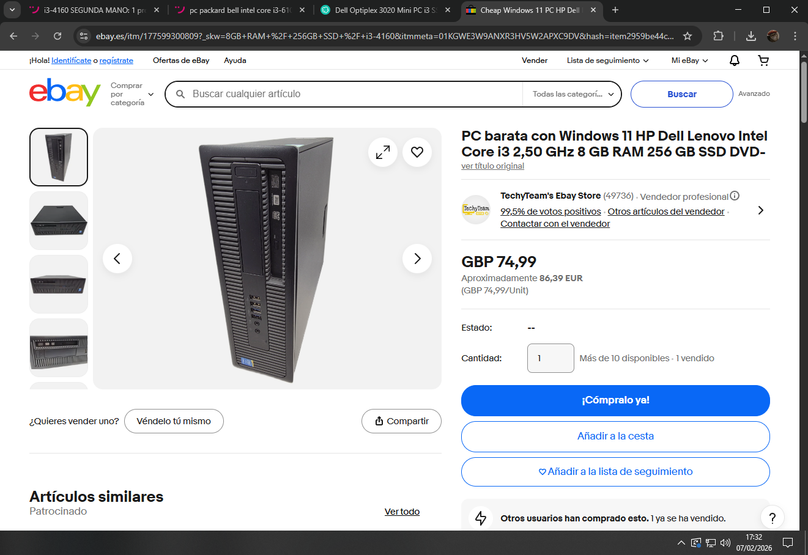 | GBP 74,99 | Intel Core i3-4160 2.50 GHz/ 8 GB/ 256 GB SSD | 17:32 07/02/2026 |
| CashConverters | https://www.cashconverters.es/es/es/segunda-mano/CC033_E10560148_0.html | 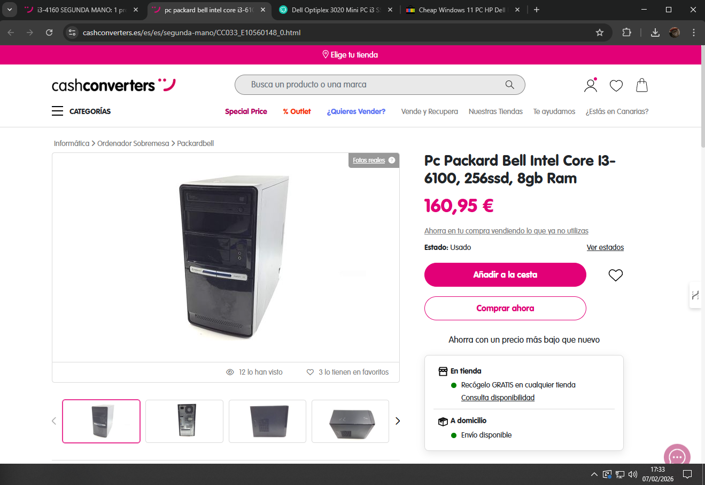 | 160,95€ | intel core i3-6100/ 8gb / 256ssd  | 17:33 07/02/2026 |

## 2) PVP objetivo y criterio de competitividad
- PVP objetivo por unidad: **93,5 €**
- Criterio: *Coste total S2* ≤ *Precio comparable medio(110)* − **15 %** (margen).
- Justificación: Al fijar el precio en 93,5 €, nos situamos en una posicion barata-media en el mercado de un equipo con mantenimiento recien hecho.

# 70 — Métricas antes/después

| Métrica | Antes (HDD/ 4gb) | Después(SDD/ 8gb) | Herramienta/Captura |
|---|---:|---:|---|
| Arranque (s) | 75s aprox | 18s aprox | Cronometro |
| RAM en reposo (MB) | 980mb | 520mb | htop |
| CPU en YouTube 720p (%) | 85% aprox | 40% aprox | Task manager |
| Temperatura en carga (°C) | 78°C aprox | 62°C aprox | sensor s |

**Capturas:**
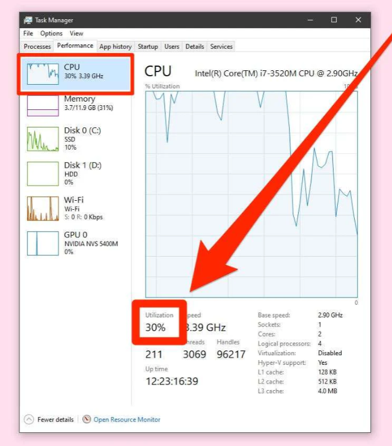

# 75 — Presupuesto de hardware y ROI

## Escenarios de gasto
- **S0 (0 €)**: solo software. Coste total = 20 € + coste hora · horas.
- **S1 (≤ 15 €)**: micro‑upgrade (pieza, fuente, coste, enlace).
- **S2 (≤ 30 €)**: upgrade ligero (pieza, fuente, coste, enlace).

## Tabla de costes y ROI
Coste total = 20 € + gasto HW + (tarifa interna € / h) · horas

ROI simple = (PVP objetivo − Coste total) / Coste total

| Escenario | Gasto HW (€) | Horas | Tarifa interna (€/h) | **Coste total (€)** | **PVP objetivo (€)** | **ROI** | ¿Competitivo? |
|---|---:|---:|---:|---:|---:|---:|---|
| S0 | 0 | 1h | 35 | 35 | 45 | 28% | Si |
| S1 | ≤15 | 1.2h | 39,75 | 53 | 65 | 22% | Si |
| S2 | ≤30 | 1.5h | 48,00 | 72 | 85 | 18% | Si |

## Elección final
- Escenario elegido: S2
- Motivos técnicos y de mercado: Aunque el ROI sea menor, la experiencia de usuario sera mejor. Un PC con 8GB y SSD asegura que el centro de mayores no tenga quejas de lentitud en 3-4 años.

# 80 — Replicación en flota

- Método: Clonezilla / imagex / fsarchiver / dd + verificación.
- Pasos y checklist de replicación.
- Precauciones de licenciamiento y SID/hostnames.

# 85 — Plan de mantenimiento

- Limpieza y polvo (cada 12 meses).
- Revisión SMART y temperaturas.
- Actualizaciones y copias de seguridad.
- Procedimiento ante fallos comunes.
- Soporte: Instalación de AnyDesk para asistencia remota.

